## Actividad 06: Jugando con funciones


## Sebastián Hernández Mantilla

## Desarrollo
### Representación de funciones univariadas
#### Para las siguientes funciones
- f(x)=x^3+x^2, x∈R
- f(x)=e−^2, x∈R
- f(x)=xcos(αx), −10≤x≤10
- f(x)=x^2, −1≤x≤1
- f(x)=sin(x)x , −1≤x≤1

#### se requiere:
#### A.) Obtener su gráfica y clasificarlas en: Convexa o Concava, Continua o Discontinua y si es Suave o no 

#### Para comprobar que una función es concava o convexa,(en un intervalo I), se utiliza la siguiente regla:
- Si f''(x) > 0 para toda x en I, la función es convexa 
- Si f''(x) < 0 para toda x en I, la función es concava

#### Para saber si una función es continua se puede decir que:
- Dado una función f(x) y un intervalo I para cualquier punto c ∈ I la función es continua si se cumple que el límite de f(x) cuando x tiende a c, es igual por la parte positiva y la la parte negativa
- Se puede utilizar un regla mucho más intuitiva: la función es continua si al dibujarla a mano no es necesario levantar el lapiz del papel

#### Para saber si una función es suave se utiliza la siguiente regla:
- Dado una función f(x) y un intervalo I para cualquier punto c ∈ I la función es continua si es diferenciable en todo el intervalo

#### B.) De una de las funciones, obtener su primera y segunda derivada, y graficar las tres curvas en el mismo plano

### A.)Gráfica y clasificación

### 1.) f(x)=x^3+x^2, x∈R


```python
import math
from sympy import symbols,cos,sin
from sympy.plotting import plot
from sympy import *
```


```python
x = symbols('x')
p1 = plot(x**3+x**2, show=False)
p1.show()
```

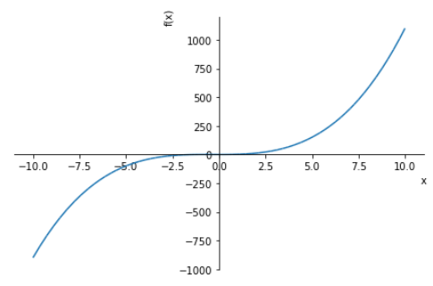

#### Gráfica de la segunda derivada


```python
deriv1 = diff(x**3+x**2, x)
deriv2 = diff(deriv1, x)
plot(deriv2)
#deriv2
```

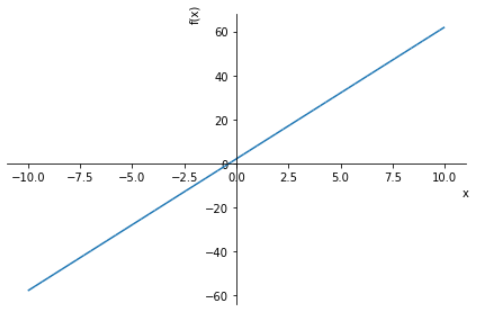

- Para el intervalo [-10,0) la función es convexa 
- Para el intervalo (0,10] la función es concava
#### Además la función es continua y suave Continua  

### 2.) f(x)=e−^2, x∈R


```python
val = math.exp(-2) 
p2 = plot(val, show=False)
p2.show()
```

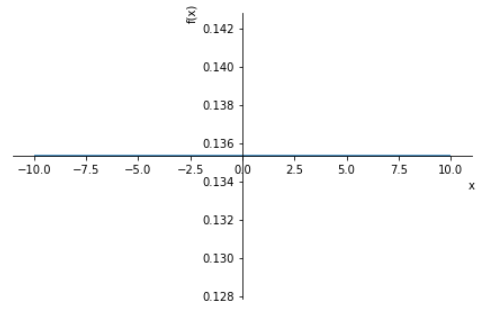

#### La segunda derivada de esta funcion es 0, esto quiere decir que la función no es ni concava ni convexa


```python
deriv1 = diff(val, x)
deriv2 = diff(deriv1, x)
print('Primera derivada: ',deriv1)
print('Segunda derivada: ',deriv2)
```

    Primera derivada:  0
    Segunda derivada:  0
    

#### La función es continua y suave

### 3.) f(x)=xcos(αx), −10≤x≤10


```python
x = symbols('x')
p3 = plot(x*cos(x), show=False)
p3.show()
```

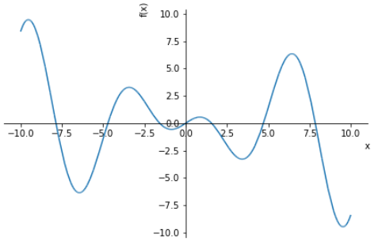

#### Gráfica de la segunda derivada


```python
deriv1 = diff(x*cos(x), x)
deriv2 = diff(deriv1, x)
plot(deriv2)
```

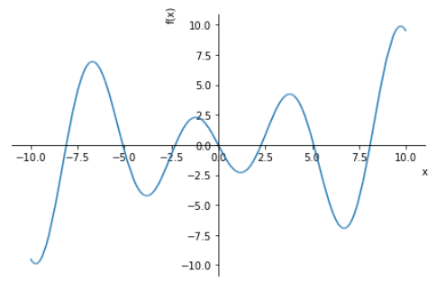

#### Para todo el intervalo no se puede decir que la función es concava o convexa

### 4.) f(x)=1/|x|, −1≤x≤1


```python
x = symbols('x')
#p3 = plot([x >= -10, x <= 10, x*math.cos(x)], show=False)
p4 = plot(1/abs(x), xlim=[-1,1], show=False)
p4.show()
```

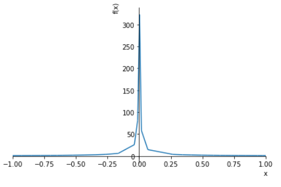

#### La función no es derivable en 0,(f(0) tiende a infinito),esto quiere decir que la función no es suave ni continua 
#### Para el intervalo [-1,0) y (0,1] la función es positiva

### 5.) f(x)=x^2, −1≤x≤1


```python
x = symbols('x')
#p3 = plot([x >= -10, x <= 10, x*math.cos(x)], show=False)
p5 = plot(x**2, xlim=[-1,1], show=False)
p5.show()
```

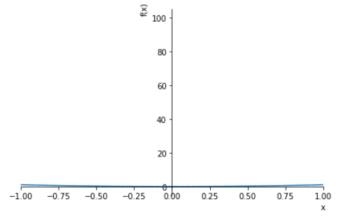


```python
deriv1 = diff(x**2, x,xlim=[-1,1])
deriv2 = diff(deriv1, x)
plot(deriv2)
```

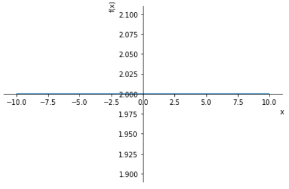

#### La segunda derivada es positiva en todo el intervalo esto quiere decir que la función es convexa
#### La función es continua y suave

### 6.) f(x)=sin(x)x , −1≤x≤1

#### Convexa


```python
x = symbols('x')
#p3 = plot([x >= -10, x <= 10, x*math.cos(x)], show=False)
p6 = plot(sin(x)*x, xlim=[-1,1], show=False)
p6.show()
```


```python
deriv1 = diff(sin(x)*x, x)
deriv2 = diff(deriv1, x)
plot(deriv2, xlim = [-1,1])
```

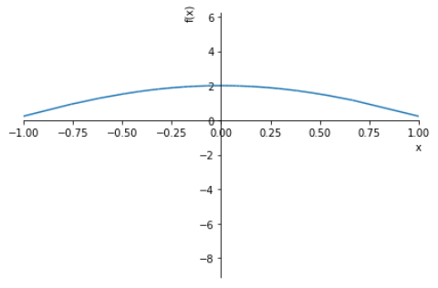

#### La segunda derivada es positiva en todo el intervalo esto quiere decir que la función es convexa
#### La función es continua y suave

### B.) Para f(x) = sin(x)*x se obtienen la primera y segunda derivada y se grafican


```python
from sympy import *
import sympy
x = symbols('x')
fun = sin(x)*x
deriv1 = diff(sin(x)*x, x)
deriv2 = diff(deriv1, x)
p6 = sympy.plot(sin(x)*x, xlim=[-10,10], show=False)
p7 = sympy.plot(deriv1, xlim=[-10,10], show=False)
p8 = sympy.plot(deriv2, xlim=[-10,10], show=False)

p6.extend(p7)
p6.extend(p8)
#p9.extend(p8)
p6[1].line_color = 'r'
p6[2].line_color = 'g'

p6.show()
```

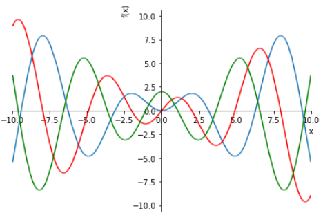

- Rojo: 𝑥sin(𝑥) 
- Verde: 𝑥cos(𝑥)+sin(𝑥) 1° derivada 
- Azul −𝑥sin(𝑥)+2cos(𝑥) 2° derrivada

## Representación de funciones de dos variables
#### Para la función f(x1,x2)=100(x2−x2^2)+(1−x1)^2 , xi ∈ [−2.048,2.048], i=1,2 se grafican las curvas de nivel 


```python
import plotly.graph_objects as go
import pandas as pd
```


```python
import numpy as np
import matplotlib.pyplot as plot
import pylab

# lista de puntos para x & y
XPoints     = []
YPoints     = []

# se crea el rango de x & y dentro de [-2.042,2.042] 
for val in range(-20, 21, 1):
    XPoints.append(val/10)
    YPoints.append(val/10)

# se inicializa z como superficie
ZPoints     = np.ndarray((41,41))

# se crean los resultados en z     
for x in range(0, len(XPoints)):
    for y in range(0, len(YPoints)):
        ZPoints[x][y] = 100 * (YPoints[x] - XPoints[x]**2) + (1-XPoints[x])**2

# grafica 
pylab.xlim([-3,3])
pylab.ylim([-3,3])

plot.title('Curvas de nivel')
plot.xlabel('X')
plot.ylabel('Y')

# curvas de nivel o de contorno
contours = plot.contour(XPoints, YPoints, ZPoints)
plot.clabel(contours, inline=1, fontsize=10)

plot.show()
```

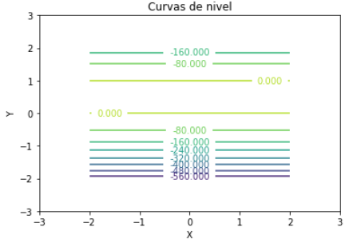


```python
import plotly.graph_objects as go
import pandas as pd
import numpy as np

fig = go.Figure(data=[go.Surface(z=ZPoints, x=XPoints, y=YPoints)])
fig.show()
```

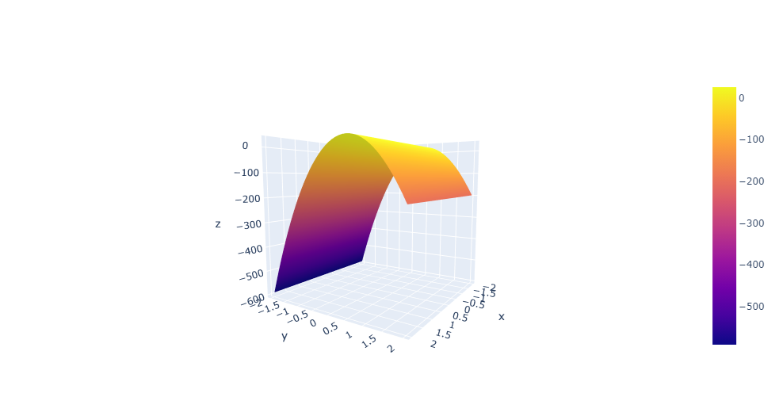

### Bibliografía

- https://www.hec.ca/en/cams/help/topics/The_second_derivative.pdf
- https://www.sympy.org/es/
- https://plotly.com/python/3d-surface-plots/
- https://www.khanacademy.org/math/ap-calculus-ab/ab-limits-new/ab-1-11/v/continuity-at-a-point#:~:text=Saying%20a%20function%20f%20is,equal%20to%20f(c).
- https://pythontic.com/visualization/charts/contour%20plot    


```python

```
